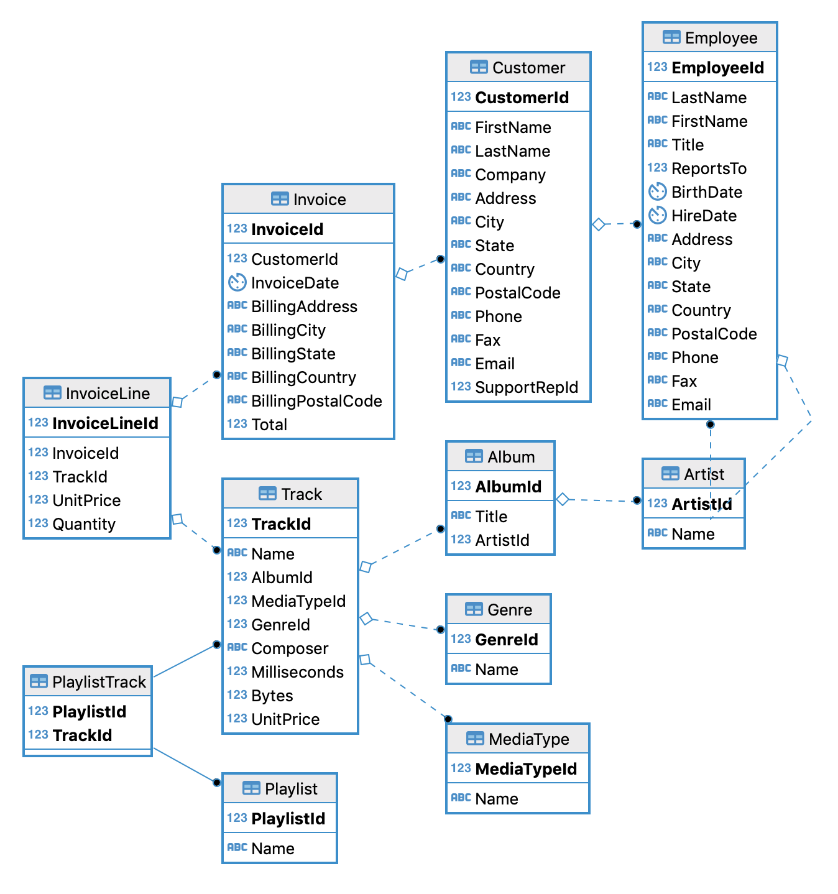

Chinook Database 1.4
============

https://github.com/lerocha/chinook-database

PostgreSQL utf8 port of the Chinook Database

INSTALL
-------

```
createdb -E UTF8 chinook
psql -f Chinook_PostgreSql_utf8.sql -d chinook   
```

DATA MODEL
-----------



NOTES
-------

The original sql file was converted to utf8 like so
````
iconv -f ISO-8859-1 -t UTF-8 Chinook_PostgreSql.sql > Chinook_PostgreSql_utf8.sql
```
